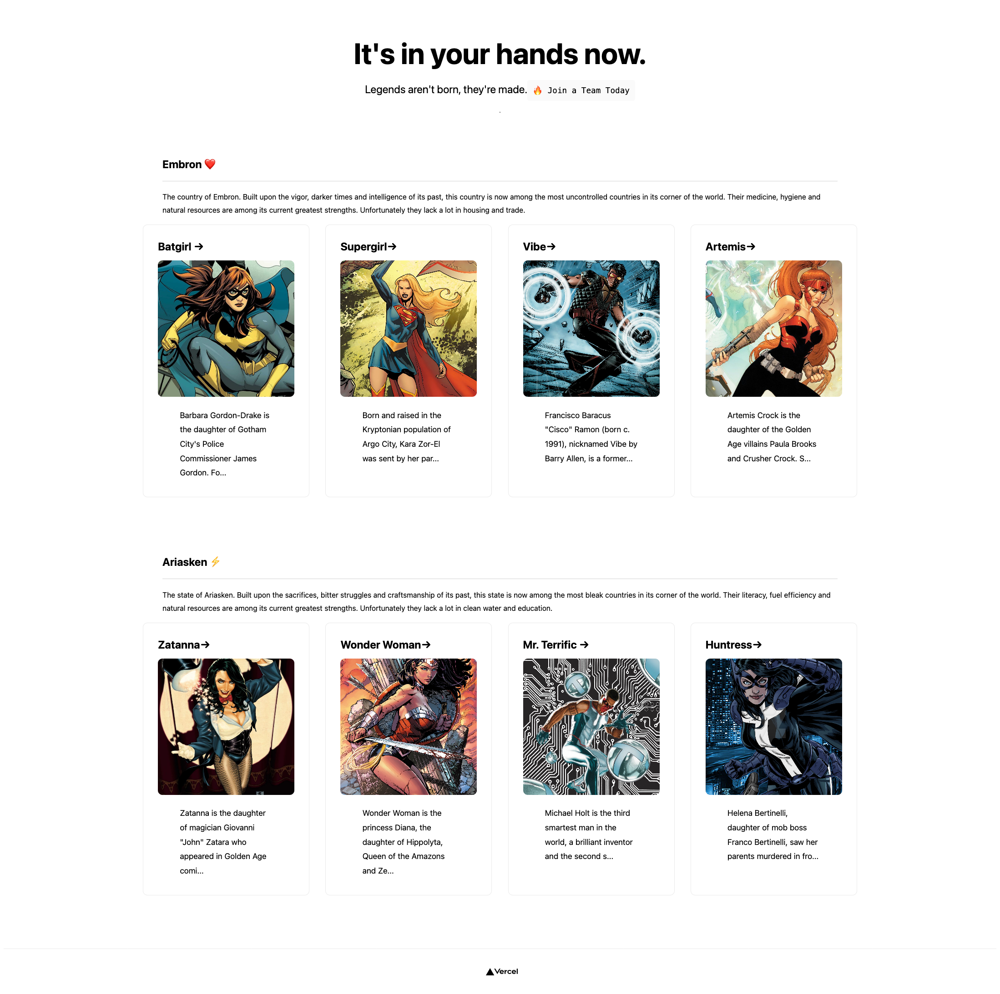

# ⚡️ Next + Strapi Sandbox  (Frontend)
I wanted to explore creating static sites powered by Next w/ data and content delivered via Strapi.  
⚡️ This repo will serve as a continuous testing environment.


**Default evelopment Server:** ```http://localhost:1337/api```

| ✅ | Basic site w/ Dynamic Data |
| ----------- | ----------- |
| 🛠| Programatically Generate Pages|
| ⭕️| Routing and Navigation|
| ⭕️| Use Image and Font Optimization|
| ⭕️| Deploy Production Build|


---


## Basic site w/ Dynamic Data:
In Strapi we have defined two content-types: Teams and Characters.
With a simple API call we can pull the relevant data and generate components to match our backend model.

```
export async function getStaticProps() {
  const res = await fetch('http://localhost:1337/api/teams?populate[characters][populate]=*');
  const data = await res.json();

  return {
    props: {
      data
    }
  }
}

```




### Relevant Character Schema in Strapi:
```
  "attributes": {
    "Name": {
      "type": "string"
    },
    "Bio": {
      "type": "text"
    },
    "Occupation": {
      "type": "string"
    },
    "story": {
      "type": "relation",
      "relation": "oneToOne",
      "target": "api::story.story"
    },
    "Photo": {
      "allowedTypes": [
        "images",
        "files",
        "videos"
      ],
      "type": "media",
      "multiple": false
    }
  }
```
